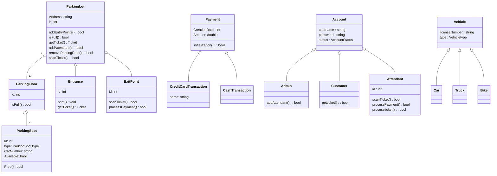

# Design Parking Lot.
## System Requirement.
1. parking lot should have multiple floors, floors contain multiple spots.  
2. multiple entry and exit points. (implement later).
3. customer get a ticket from entry point and return ticket at the exit point.
4. payment can be **in cash** and via **credit card**.  





# Design library.
## system requirement.
1. customer can **borrow** a book from library **return** the book to the library.  
2. customer could **buy** book from libary.  
3. customer can **search** for keyword. (library should return the recommended book).
4. Attendat can add or remove the new book to the system.  
5. customer could be notified if the book is available.

## class hierarchy.
```mermaid
classDiagram
    %% Library.
    library o-- Panel
    library o-- Book
    class library {
        id : int
        address: string
        zipcode: int
        description : string

        search(string keyword) : Book
        Borrow(Book) : bool
        Return(Book) : bool
        Buy(book) : bool
        Add(Book) : bool
        Remove(book): book
    }

    class Panel {
        id : int 

        search(string keyword) : Book
        Borrow(Book) : bool
        Return(Book) : bool
        Buy(book) : bool
        Add(Book) : bool
        Remove(book): book
    }

    %% Book
    class Book {
        id : int
        name: string
        author : string
        PublishedDate: datetime
        Location: string
        Status: BookStatus
        type: Booktype
        Amount: int
    }
    class BookStatus {
        <<enumeration>>
        Active
        Borrowed
        Removed
    }
    class Booktype {
        <<enumeration>>
        EconomicBook
        BusinessBook
        EntainmentBook
    }

    Book <|-- Bookitem
    %% class Bookitem {
        id : int
        barcode : string
        Status: BookStatus
        type : Booktype
    }

    %% BookLending.
    class BookLending {
        User: Account
        Bookitem: bookitem
        creationTime: datetime
        dueDate: datetime
        returnDate: dateTime.
    }
    

    %% Account
    library o-- Account
    Account <|-- Admin
    Account <|-- Member
    class Account {
        username: string
        password: string
        email: string
        id : int
        type: AccountType
    }
    class AccountType {
        <<enumeration>>
        Admin
        Customer
        Attendant
    }
    class Admin {
        addBook(): bool
        removeBook(): bool
        renewBook(): bool
        ReturnBook(): bool
        addMember(): bool
    }
    class Member {
        num_borrow : int
        borrowItem: booktime
        borrow()
        return()
        renewBook(): bool
    }
    
    %% fine transaction.
    class fine {
        amount: double
        getAmount() : double
    }
    fineTransaction <|-- CreditCardTransaction
    fineTransaction <|-- CashTransaction
    class fineTransaction {
        Amount : double
        intialization() : bool
    }

    class CreditCardTransction {

    }
    class CashTransction {

    }
```


# Design online Amazon shopping system.(OOD)
# requirement
1. Member could **buy** items or **return** items. 
2. Member could add item to shopping card.
3. Member could add comment to purchased items.
4. Member could pay with credit card or debit card.
5. Member could search for items by the name or catogory.
6. Member could keep track of the shippment.


# class hierarchy.


# design stackOverflow
## Requirement
1. Guests can search for questions.
2. Users can post a **question** and post an **answer** to a question.  (member)
3. users and upvote for answer (member).
4. member can add a comment on the comment section.  
5. member can tag the questions.  
6. System can identify most frequently used tags in the questions.  


## 
