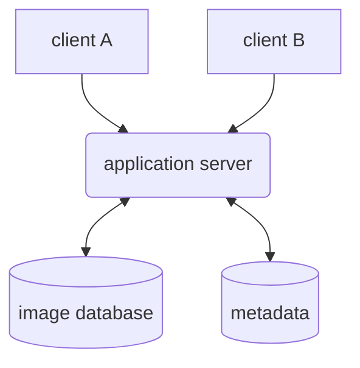
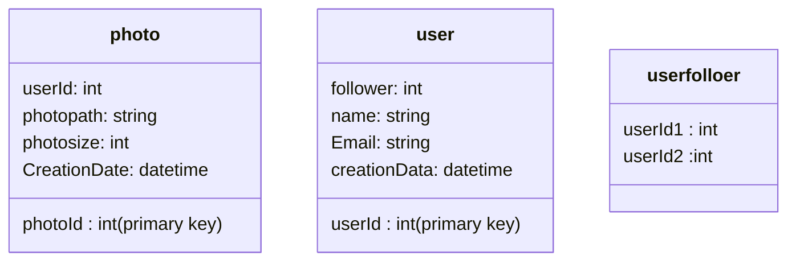

# Requirement. (design intagram)
1. users **upload** and **download** videos/photos/text
2. user could follower other users. 
3. user could search the keyword. (return the phonts)
4. system generate new feeds for different users.

# nonfunctional-requirement.
1. system should be hightly available.
2. the acceptable latency should be less than **200 ms**. 
3. consistency could take a hit if user doesn't see a photo for a while.
4. reliable. any uploaded photo should never be lost.

# Design Consideration. 
1. the system should be read-heavy. (focus on the read operation)
2. low-latency is expected viewing the photo.
3. 100% relibalbe 

# capacity estimation and constraints.
1. 500M users.(total).   1M daily active users.
2. 2M photos every day.   23 photos in a day.
3. 150KB. (photo size)
space: 150KB * 2M = 400G.
for 10 years; 400GB * 365 * 10 = 1425 TB.


# API.
1. getNewFeed(clientId,): feeds.
2. Search(clientId,keywor): feeds.
3. follow(clientId, DestinationID): bool
4. upload(clientId, text, phote=None)

# high level Design


# table.


# data size estimation.
**user**
```
userId(4bytes) + name(20 bytes)  +  email(32 bytes) === 68 bytes.  
68 * 500M  = 32 GB
```

**photo**
```
0.5 GB per day

```